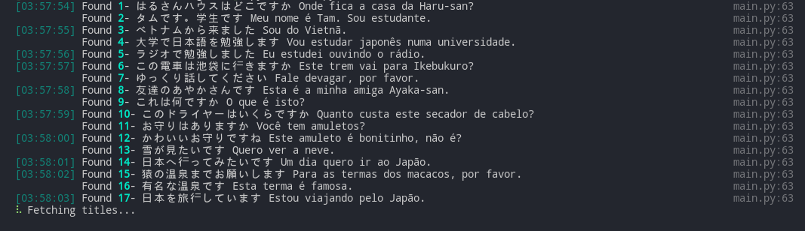
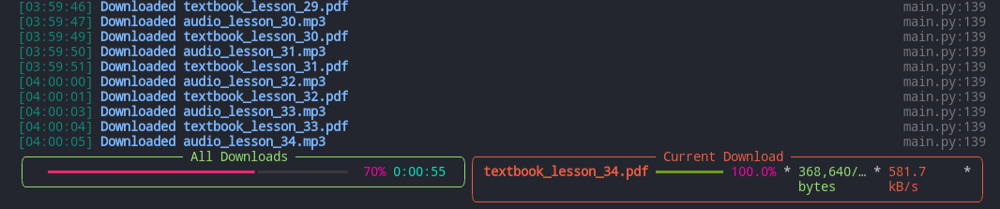

# Nihongo_nhk

This is a script to download some free japanese lessons in portuguese from NHK.

It can be executed by installing the packages with:

```pip install -r requirements.txt```

and then:

```python main.py```

All files will be downloaded at a ```./downloads``` folder, each lesson having it's own folder. 

The script will download both the textbook and the audio lesson from the course.Right now, it will download just content in portuguese, but this will change in the future.


### Images




Obs.: The only actual correct info showed by 'Current Download' progress bar is the name of the current file being downloaded. The others are, for sure, wrong.